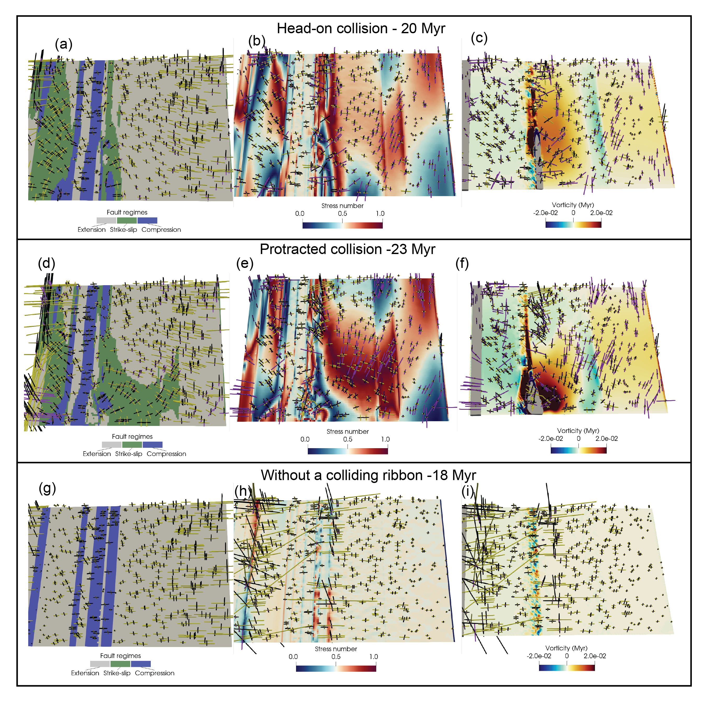
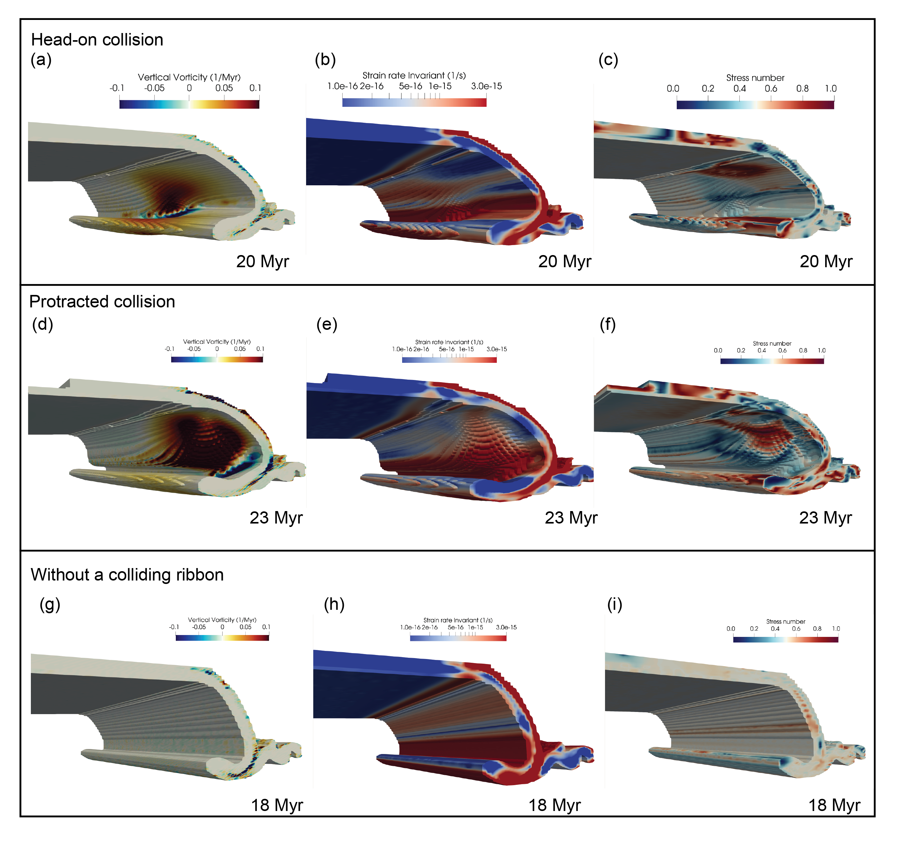
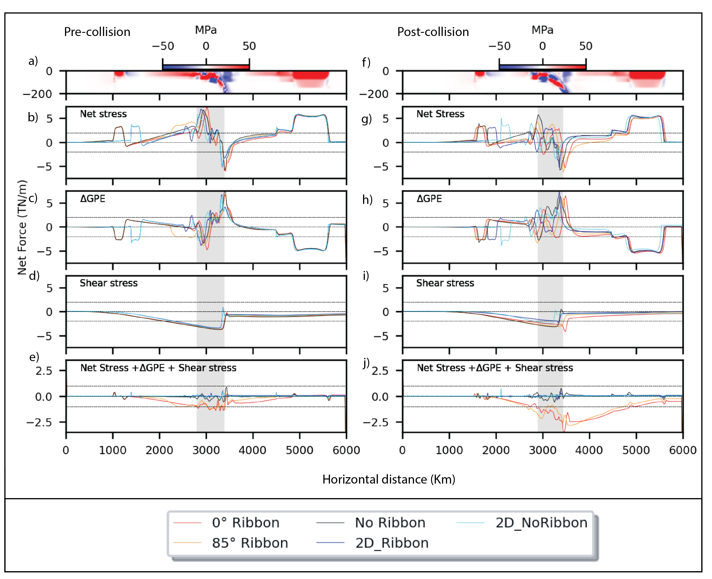

# Subduction system response to ribbon collision: implications on the intra-plate force balance and the style of slab deformation

## Abstract

Ribbon collision is a process that can rapidly disturb the symmetry of subduction zones. Previous studies have demonstrated how ribbon collision causes rotation at the surface and contortion in the slab, but have focused on the surface kinematics. We use three-dimensional mechanical models to investigate how the dynamic evolution of ribbon collision perturbs the strain and stress field at the surface, the deformation style in the slab and the force balance in intra-plate regions. In our set of numerical simulations, we vary the angle between the trench and the ribbon to explore the slab response to ribbons colliding at different orientations. Our numerical simulations show that ribbon collision causes significant heterogeneity of stress, strain rate and vorticity in both the overriding and subducting plates surface and the slab. Slab deformation shows compartmentalization into low and high strain-rate regions around a high vorticity zone, with strain-rate variations of up to and order of magnitude occurring in both the along-strike and down-dip directions. The simulations show that changes in the collision orientation lead to contrasting styles of intra-slab deformation, where regions of high strain might yield and cause strain localization, fault activity and intra-slab seismicity. In the context of our idealised oceanic-continental subduction system, the simulations show that intra-plate stresses are affected to a similar degree by buoyancy contrasts (i.e. gravitational potential energy variations), slab-pull and ribbon collision. This partitioning allows for significant heterogeneity in the intra-plate stress regime. This work highlights how the rapid changes in strain-rate within the slab, caused by ribbon collision, can explain the seismicity gaps observed in collisional margins, which are often interpreted as slab-tears. 

### Surface-view

### Slab-view

## Force Balance

## This repository
Contains the original notebooks  scripts used to ran the numerical simulations presented in the paper: "Subduction system response to ribbon collision: implications on the intra-plate force balance and the style of slab deformation", within the folder "UWGeodynamics_Scripts". Additionally, it contains the data for computing the force balance plot. The data of the 2D models is not available due to GitHub limitations on filesizes. If need you need those files, contact andres.rodriguez1@sydney.edu.au. 
